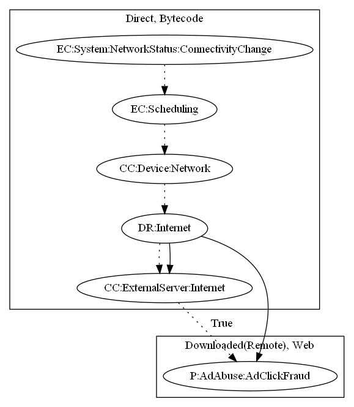

# AdClickerBN

## High-level Description

* Year: 2017
* File Hash (SHA-256): 50247e85ecb6452aa847a572ca04ab310cf8e9288520f824d13ebcc207be7c13
* Blog: https://securingtomorrow.mcafee.com/other-blogs/mcafee-labs/android-click-fraud-apps-briefly-return-google-play/

This malware sample contains the ability to perform ad-click fraud on the unsuspected user. To perform this malicious behavior, the malware listens on connectivity change and checks whether the internet is available. The sample retrieves commands and JavaScript code containing the payload from the Internet. It then runs the retrieved JavaScript in a WebView. An alarm repeats the ad click fraud process.

## Signature
---

The image of the signature can be downloaded [here](../../img/signatures/AdClickerBN.png) for closer inspection.

