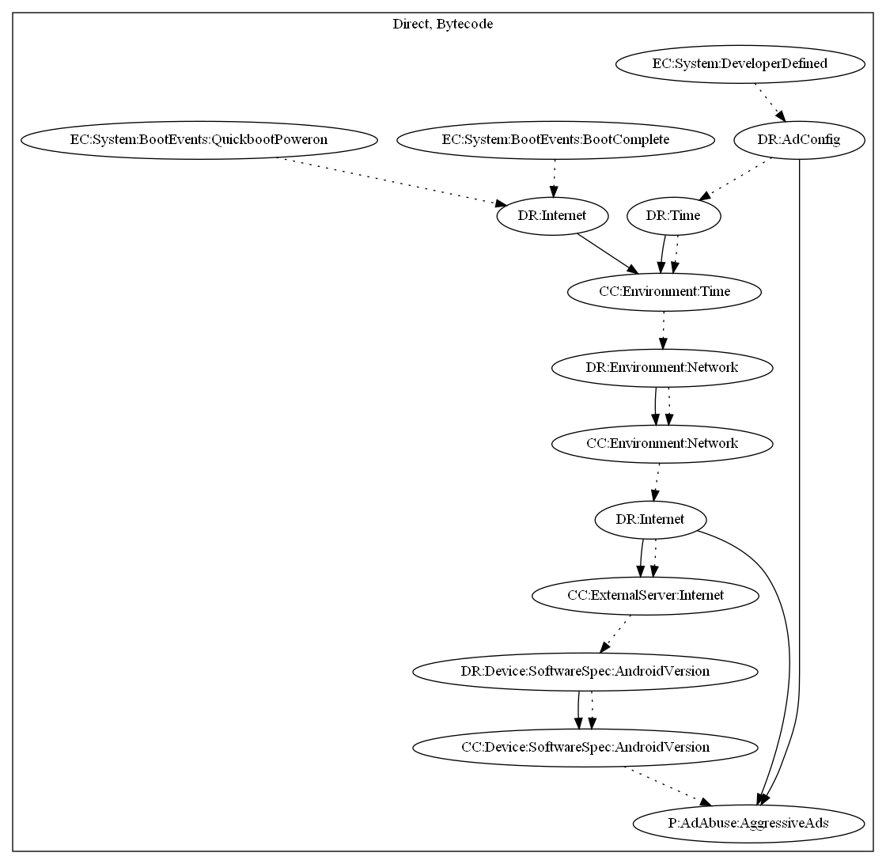

# AdQR

## High-level Description

* Year: 2021
* File Hash (SHA-256): 60d70a66bc19b6ead904b3efdec5dc5b4d2c7fb706d60bbd42a0f663e987d655
* Blog: https://blog.malwarebytes.com/android/2021/02/barcode-scanner-app-on-google-play-infects-10-million-users-with-one-update/

This malware sample aims to push full screen advertisement to the user. It attempts to retrieve configuration from the malware developer's server after receiving messages from Firebase. It then displays ads if the Android version is less than version 29.

## Signature
---

The image of the signature can be downloaded [here](../../img/signatures/AdQR.png) for closer inspection.

