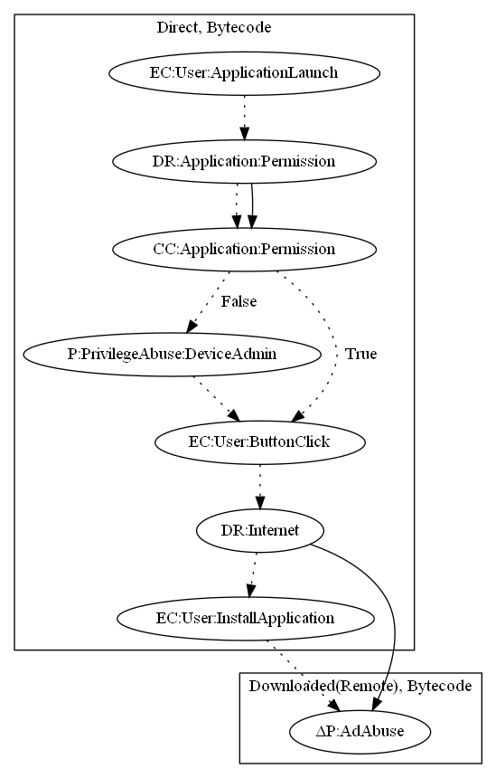

# AgentJL

## High-level Description

* Year: 2017
* File Hash (SHA-256): e3c83bb1acb4c2132cce2c849fa98a336593825746d44aa20ea2c2beb86c003b
* Blog: https://www.welivesecurity.com/2017/03/23/download-minecraft-mods-google-play-read/

This malware sample acts as a minecraft loader. Behind the scenes, the malware downloads and entices a user to install another APK which performs an ad abuse payload. The application first requests device admin privileges on launch. Once the user clicks on the "Install" button, the sample prompts the user with a dialog describing a secondary application to "load minecraft mods". Once the user accepts installation, the secondary payload performs ad abuse.

## Signature
---

The image of the signature can be downloaded [here](../../img/signatures/AgentJL.png) for closer inspection.

