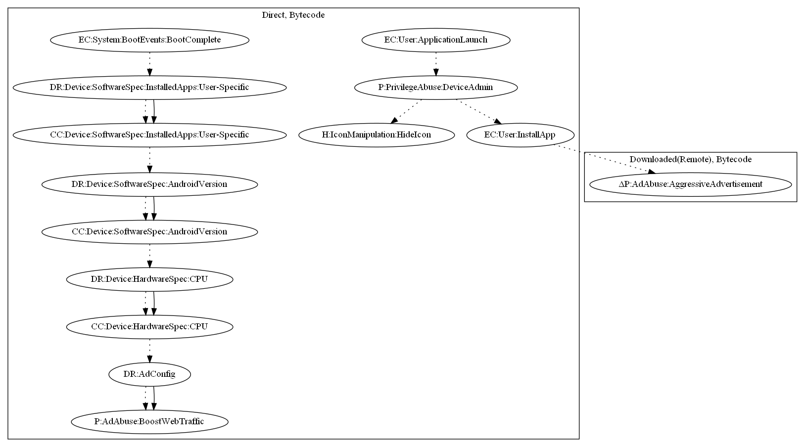

# Aladdin

## High-level Description

* Year: 2018
* File Hash (SHA-256): bec2b94ea7d0baa970884da8e00d1366df8b0ccb51b354aca8203e2160d07d4c
* Blog: https://www.symantec.com/blogs/threat-intelligence/hidden-app-malware-google-play

This malware sample aims to perform ad abuse payloads. On launch of the application, the malware sample directly requests device admin privileges, and opens up Google Play Store in hopes that the user installs a secondary malware app. The secondary malware app pushes full screen advertisements to the user. On boot complete, the malware sample checks that the app meets a specific Android version and contains a minimum number of CPU cores. It then opens an invisible website to perform web traffic boosting based on a hard coded list of ad URLs.

## Signature
---

The image of the signature can be downloaded [here](../../img/signatures/Aladdin.png) for closer inspection.

