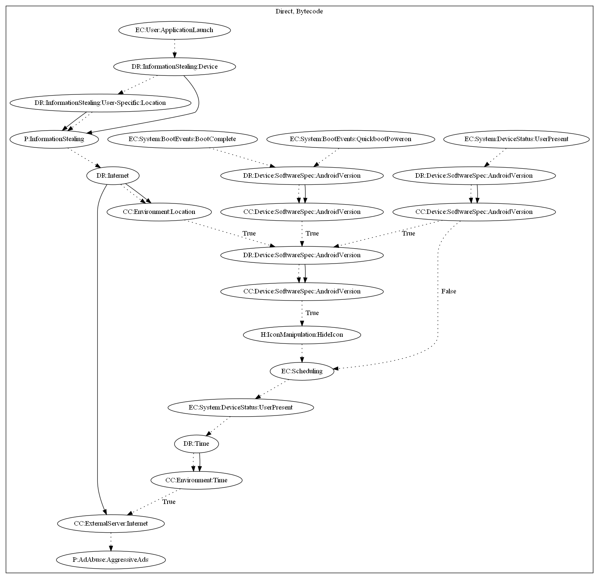

# Asher

## High-level Description
* Year: 2019
* File Hash (SHA-256): a42e141443f94e08c76dc92bdeb1243db8bd1618622c974b883381ddf243a55f
* Blog: https://www.welivesecurity.com/2019/10/24/tracking-down-developer-android-adware/

This malware application aims to perform aggressive advertisement payloads. The malware retrieves ad configuration from the C&C server on launching the application. The malware also checks the ip of the device to ensure the device is not under a Google domain. If the Android SDK is above a certain version, the malware sample registers an alarm receiver and broadcast receiver to trigger when the user unlocks the device. It is important to note that the broadcast receiver is also triggered on boot complete, quickboot power on, and user present events. The malware sample pushes an ad to the user if a set time has passed since the last displayed ad.

## Signature
---

The image of the signature can be downloaded [here](../../img/signatures/Asher.png) for closer inspection.

