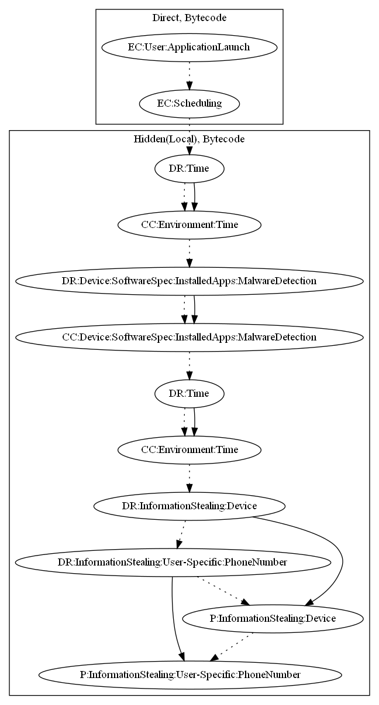

# AxentDS

## High-level Description

* Year: 2017
* File Hash (SHA-256): a23a63f9c703f3f1a9d05e4dae51924bc1d4752f23f4f126990391ab07963e7b
* Blog: https://nakedsecurity.sophos.com/2017/05/02/super-free-music-player-in-google-play-is-malware-a-technical-analysis/

This malware sample aims to load a payload within assets which steals device and sensitive information. On user launch, the sample loads the local payload and implements an alarm to run periodically. The application then contains a time bomb, which waits 2 hours before performing additional tasks. Afterwards, the malware sample checks for analysis tools (such as TaintDroid), runs another time bomb of 8 hours, before collecting the user's device information and phone number to leak to their servers.

## Signature
---

The image of the signature can be downloaded [here](../../img/signatures/AxentDS.png) for closer inspection.

