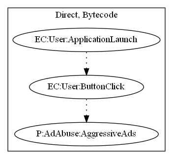

# Blacklister

## High-level Description

* Year: 2018
* File Hash (SHA-256): 747d1a30332a8731bc4f41f2381c7b9ce16047e5cf5933db1aa310edc0db41f8
* Blog: https://www.welivesecurity.com/2018/04/05/google-play-ad-slingers/

This malware sample acts as a fake antivirus. Every time the user presses a "scan" button, ads are annoyingly displayed to the user.

## Signature
---

The image of the signature can be downloaded [here](../../img/signatures/Blacklister.png) for closer inspection.

