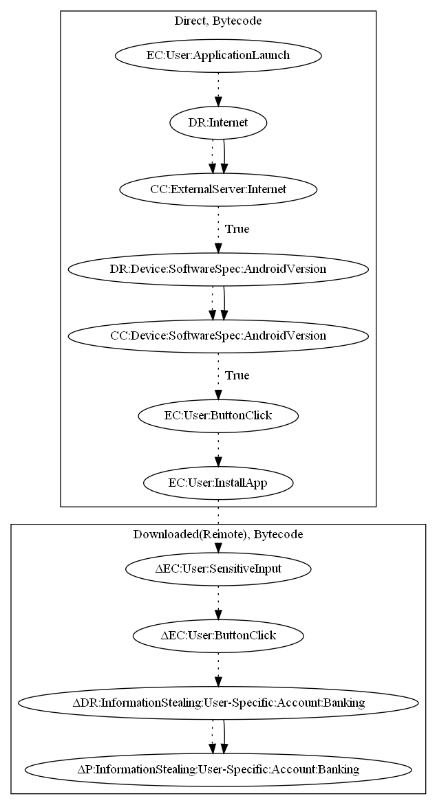

# Clast82

## High-level Description

* Year: 2021
* File Hash (SHA-256): 52adb34cc01aa8d034d71672f3efe02c8617641ee77bf6c5eb6806e834550934
* Blog: https://research.checkpoint.com/2021/clast82-a-new-dropper-on-google-play-dropping-the-alienbot-banker-and-mrat/, https://blog.checkpoint.com/2021/03/09/dangerous-malware-dropper-found-in-9-utility-apps-on-googles-play-store/

This malware sample aims to download and install a payload that aims to steal banking credentials. The app downloads the payload upon app launch, and checks whether the current Android version is less than 24. It then asks the user to install the app -- which later attempts to steal the users bank credentials (an observed behavior).

## Signature
---

The image of the signature can be downloaded [here](../../img/signatures/Clast82.png) for closer inspection.

