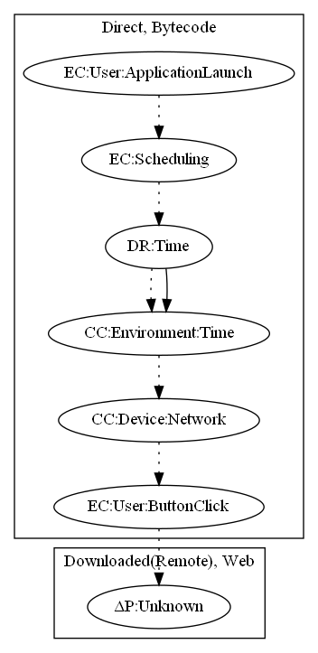

# ClickerGenG

## High-level Description

* Year: 2016
* File Hash (SHA-256): 5733210ca0218b5578e95c289b58b92c14639f4e9a29ad07f0e5528dd4cf21b9
* Blog: https://securingtomorrow.mcafee.com/other-blogs/mcafee-labs/android-malware-clicker-dgen-found-google-play/

This malware sample aims to perform an unknown web payload. The malware waits a set period of time after launch, checks for device connectivity, and displays a web page to the user. The unknown payload is most likely a scam link, as the URL is "http://update-sys-android.com", however we cannot confirm this fact.

## Signature
---

The image of the signature can be downloaded [here](../../img/signatures/ClickerGenG.png) for closer inspection.

