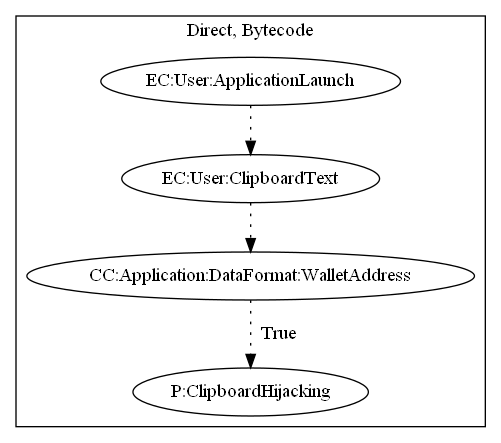

# ClipperC

## High-level Description

* Year: 2019
* File Hash (SHA-256): ea5742cf2a6087577028049e47ecb4a24c9a6e7db872a8c90ee0145f22811599
* Blog: https://www.welivesecurity.com/2019/02/08/first-clipper-malware-google-play/

This malware sample aims to hijack the user's text clipboard. Upon launch of the application, the sample registers a clipboard listener. When the user clipboards text, it checks the data format to make sure it is a wallet address. If the text is a wallet address, the malware sample replaces the address with a hardcoded string of the malware developer's.

## Signature
---

The image of the signature can be downloaded [here](../../img/signatures/ClipperC.png) for closer inspection.

