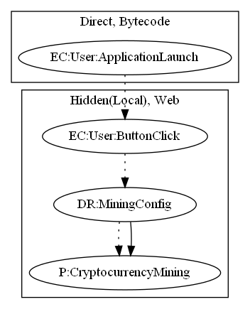

W---
layout: default
title: CoinHive
nav_order: 2
has_children: false
permalink: /docs/signature/coinhive
nav_exclude: true
---

# CoinHive

## High-level Description

* Year: 2018
* File Hash (SHA-256): 5f3fa1f3b6596e853a3c679f1d2a60e1cb598cd072e225f18e3e25d7ab64cf8e
* Blog: https://news.sophos.com/en-us/2018/09/24/cryptojacking-apps-return-to-google-play-market/', 'https://nakedsecurity.sophos.com/2018/09/27/cryptojacking-coming-to-a-server-laptop-phone-near-you-and-how-to-stop-it/

This malware application aims to mine cryptocurrency. On launch of the application, the malware loads web pages from local assets. Once the user clicks a button to open a secondary page, the page contains a script to mine cryptocurrency using the Coinhive library.

## Signature
---

The image of the signature can be downloaded [here](../../img/signatures/CoinHive.png) for closer inspection.

