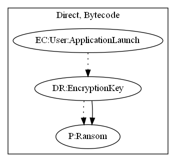

# Cyberpunk

## High-level Description

* Year: 2020
* File Hash (SHA-256): 85763589171b520806c08fd836010a4ca264ffa3dbf428cc4797fefa9136a189
* Blog: https://www.kaspersky.com/blog/cyberpunk-2077-ransomware/38196/, https://blog.malwarebytes.com/malwarebytes-news/2021/02/cyberpunk-2077-developer-hit-by-ransomware/

This malware attempts to encrypt the users device. Upon launching the application, the malware encrypts data stored under the "/mnt", "/mount", "/sdcard", and "/storage" directories.

## Signature
---

The image of the signature can be downloaded [here](../../img/signatures/Cyberpunk.png) for closer inspection.

