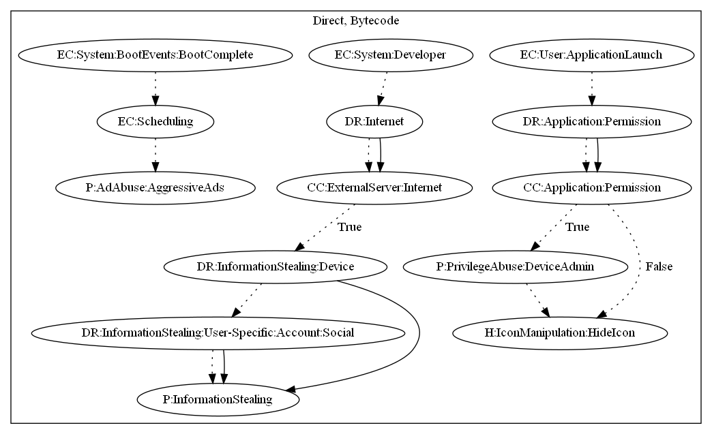

# DoubleHidden

## High-level Description

* Year: 2017
* File Hash (SHA-256): f8050e0682d5316ab63fe2eaf8ef0a6d915d45f455bf3f9204bd46a066b087a9
* Blog: https://www.symantec.com/blogs/threat-intelligence/doublehidden-android-malware-google-play

This malware sample aims to push full screen ads to the user, steal user-specific information. The sample requests device admin privileges, and immediately hides its icon upon application launch. It registers an alarm to display full screen ads periodically. Additionally, the malware sample retrieves commands from the C&C server based on push notifications to collect social accounts from the users device.

## Signature
---

The image of the signature can be downloaded [here](../../img/signatures/DoubleHidden.png) for closer inspection.

