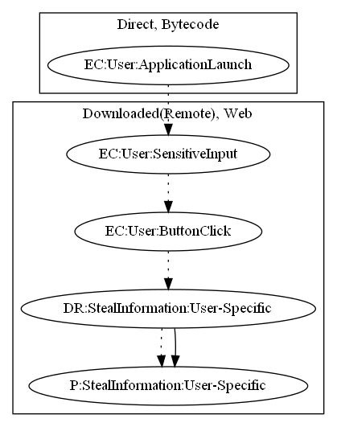

# FakeAppFG

## High-level Description

* Year: 2017
* File Hash (SHA-256): 779f7caff09f9d96e298a50b9157148b43448a40a843e99a917645d2a9ce03cc
* Blog: https://www.welivesecurity.com/2017/03/23/download-minecraft-mods-google-play-read/

This malware application immediately opens a scam link on launching the application. User-specific information is leaked as a result.

## Signature
---

The image of the signature can be downloaded [here](../../img/signatures/FakeAppFG.png) for closer inspection.

