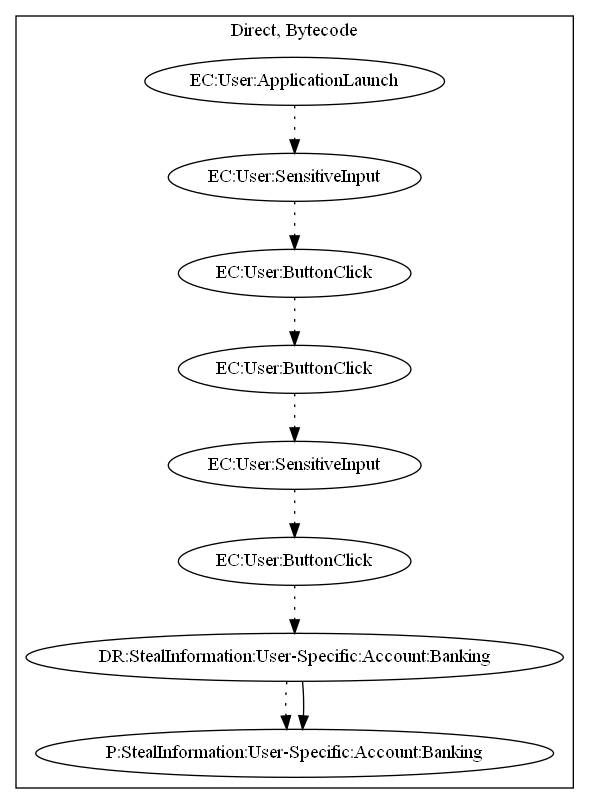

# FakeAppFK

## High-level Description

* Year: 2017
* File Hash (SHA-256): 3fd6a5138ba1b91bd15181ca337ba0fff6371d32a901289012ed40080b82fb8d
* Blog: https://www.welivesecurity.com/2017/04/13/real-virtual-currency-scammers-accept/

This malware application acts as a fake revenue generator. The user logs into the application, and watches videos to "generate revenue". The user clicks on various buttons and enters their paypal credentials into a fake paypal login page -- leaking the credentials as a result.

## Signature
---

The image of the signature can be downloaded [here](../../img/signatures/FakeAppFK.png) for closer inspection.

