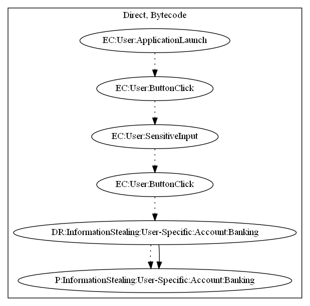

# FakeAppKO

## High-level Description

* Year: 2019
* File Hash (SHA-256): e81c3278f46f480ea3c0dda21b2781700ca438c6a4287d4746ba527134c6e71e
* Blog: https://www.welivesecurity.com/2019/05/23/fake-cryptocurrency-apps-google-play-bitcoin/

This malware application acts as a popular cryptocurrency wallet storage app. On launch of the application, the user presses a button to open a login. The user inputs their wallet credentials and logs in. Credentials are sent to the malware developer as a result.

## Signature
---

The image of the signature can be downloaded [here](../../img/signatures/FakeAppKO.png) for closer inspection.

