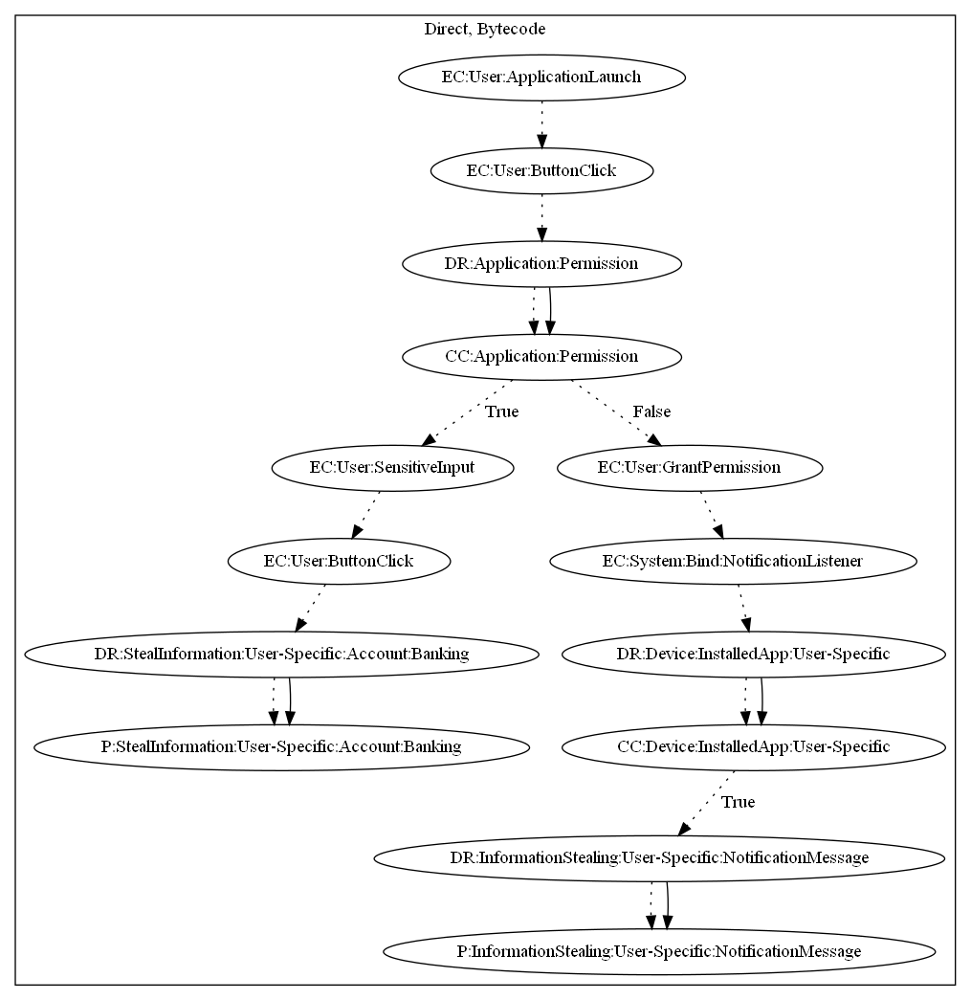

# FakeAppKP

## High-level Description

* Year: 2019
* File Hash (SHA-256): 4d431fe4cf84f13895d113f8e47e9fc9e884acffae9a66ff216f95d7cd5bd652
* Blog: https://www.welivesecurity.com/2019/06/17/malware-google-permissions-2fa-bypass/

This malware application acts as a popular cryptocurrency wallet storage app. On launch of the application, the user presses a button to open a login form. The app checks for notification listener permissions and, if not provided, requests the related permissions. Once the user inputs their credentials, the app leaks them to the malware developer's server. In addition, if the user receives notifications from the legitimate cryptocurrency application, the app scraps the notifications and leaks to the malware developer's server as well.

## Signature
---

The image of the signature can be downloaded [here](../../img/signatures/FakeAppKP.png) for closer inspection.

