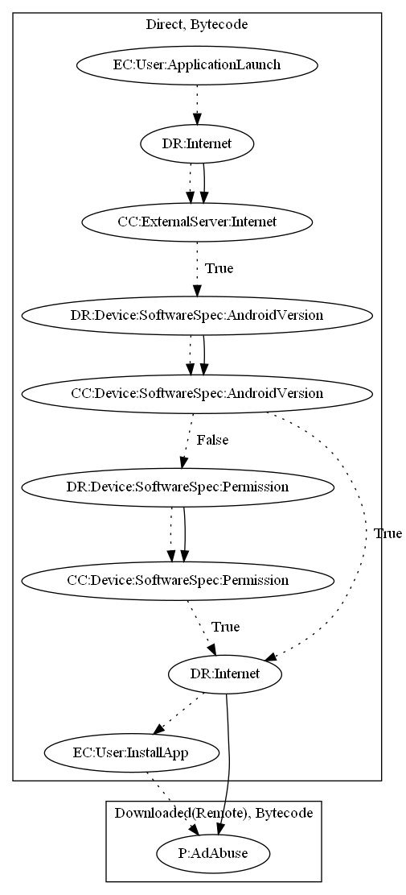

# Gambling

## High-level Description

* Year: 2019
* File Hash (SHA-256): 8db2ad04fd93704954cee498f2431e98caad9d1e9bb836debd5bbf982a2fd246
* Blog: https://www.trendmicro.com/en_us/research/19/i/gambling-apps-sneak-top-100-hundreds-fake-apps-spread-app-store-google-play.html

This malware application switches functionalities based on responses from the malware developers server. The sample collects commands from the malware developers server to download an additional payload. The installed payload is a gambling application (against Google Play Store's policies) which displays advertisements.

## Signature
---

The image of the signature can be downloaded [here](../../img/signatures/Gambling.png) for closer inspection.

