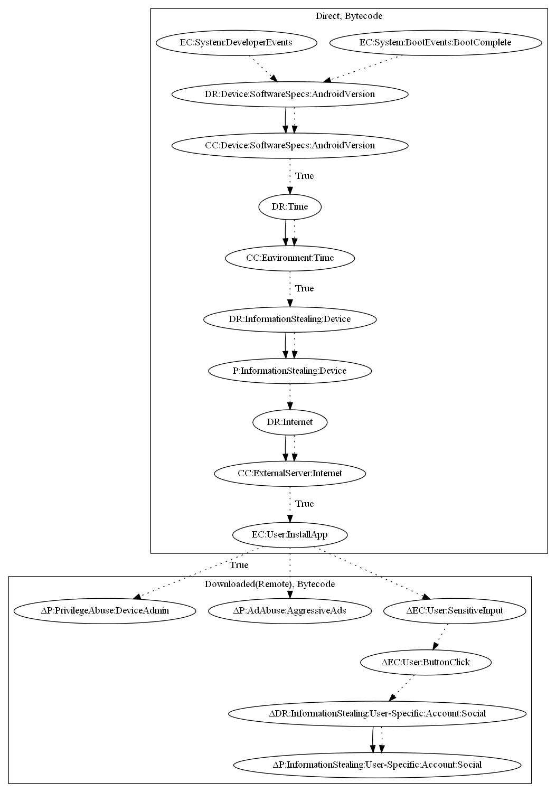

# GhostTeam

## High-level Description

* Year: 2018
* File Hash (SHA-256): d2ce55590156c8a1cdbde1109d81d4a5a2cfbc7348be87dce6020788e694ad43
* Blog: https://blog.trendmicro.com/trendlabs-security-intelligence/ghostteam-adware-can-steal-facebook-credentials/

This malware sample aims to perform privilege abuse, aggressive advertisement, and steal user information. The malware sample first checks the android version when the device boots. Device information is sent to after a set period of time afterwards. It then retrieves commands and an executable from the malware developer's server to perform privilege abuse, aggressive advertisement, and steal facebook account credentials (all observed behaviors).

## Signature
---

The image of the signature can be downloaded [here](../../img/signatures/GhostTeam.png) for closer inspection.

