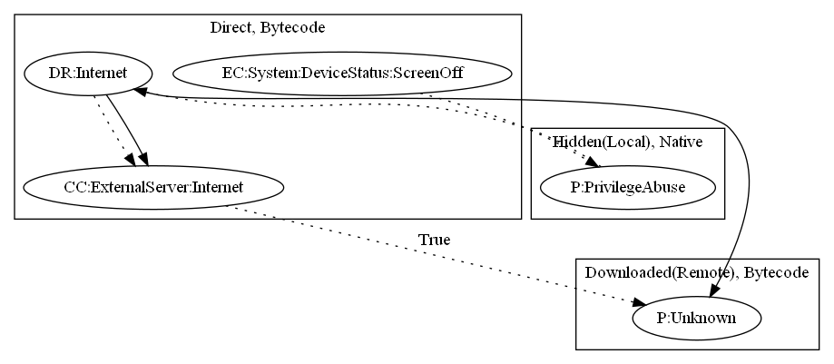

# Godless

## High-level Description

* Year: 2016
* File Hash (SHA-256): c39631acba32af58ef310b69146e90f345cdda29c346cb1c0bd4746e1a5479e7
* Blog: https://blog.trendmicro.com/trendlabs-security-intelligence/godless-mobile-malware-uses-multiple-exploits-root-devices/

This malware sample aims to perform privilege abuse and perform an additional unknown payload. The malware sample runs native asset files to perform privilege abuse. It then installs an executable based on commands sent from the malware developers server. Lastly, the malware sample performs an unknown payload. 

## Signature
---

The image of the signature can be downloaded [here](../../img/signatures/Godless.png) for closer inspection.

