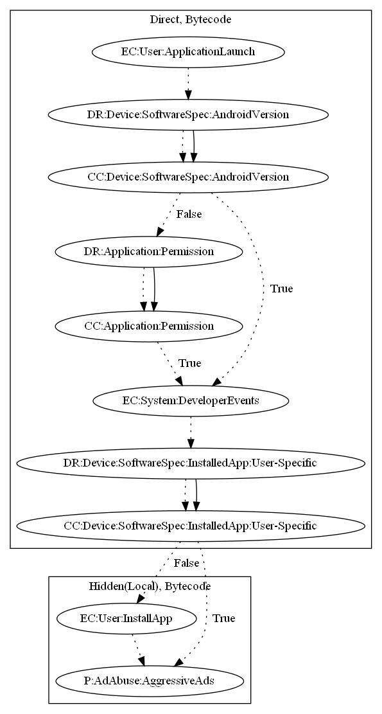

# HiddadBZ

## High-level Description

* Year: 2017
* File Hash (SHA-256): 894d2d9b7076d468dd127ecd65d87d737e7213e3dff523c382413543c68f2d64
* Blog: https://www.welivesecurity.com/2017/03/08/aggressive-ad-displaying-google-play-app-tricks-users-leaving-high-ratings/

This malware application aims to push full screen ads to the user. The malware sample downloads a malicious executable and installs the application is not already installed. The application then pushes full screen ads to the user.

## Signature
---

The image of the signature can be downloaded [here](../../img/signatures/HiddadBZ.png) for closer inspection.

