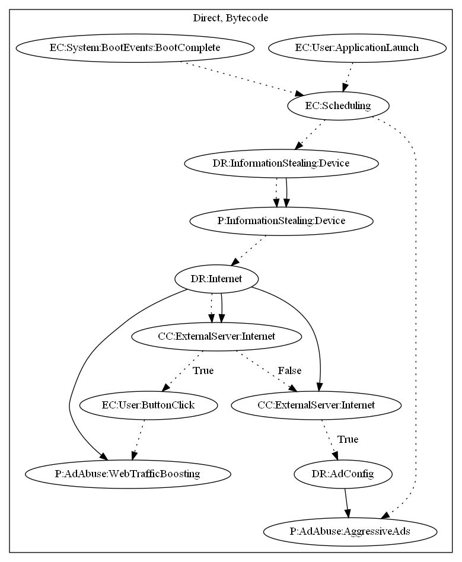

# HiddenAd

## High-level Description

* Year: 2018
* File Hash (SHA-256): 10e3ceb69f1e4818ebd5e481f9c86c076cd15052559553fdf1a52a00a8059208
* Blog: https://nakedsecurity.sophos.com/2018/03/23/crooks-infiltrate-google-play-with-malware-lurking-in-qr-reading-utilities/

This malware application aims to push full screen ads to the user. The malware implements an alarm based on boot events and application launch to routinely contact the malware developers server. It then retrieves commands from the server to either (1) push notifications that the user can click to perform web traffic boosting, or (2) collect ad configuration that is necessary to push full screen ads to the user.

## Signature
---

The image of the signature can be downloaded [here](../../img/signatures/HiddenAd.png) for closer inspection.

