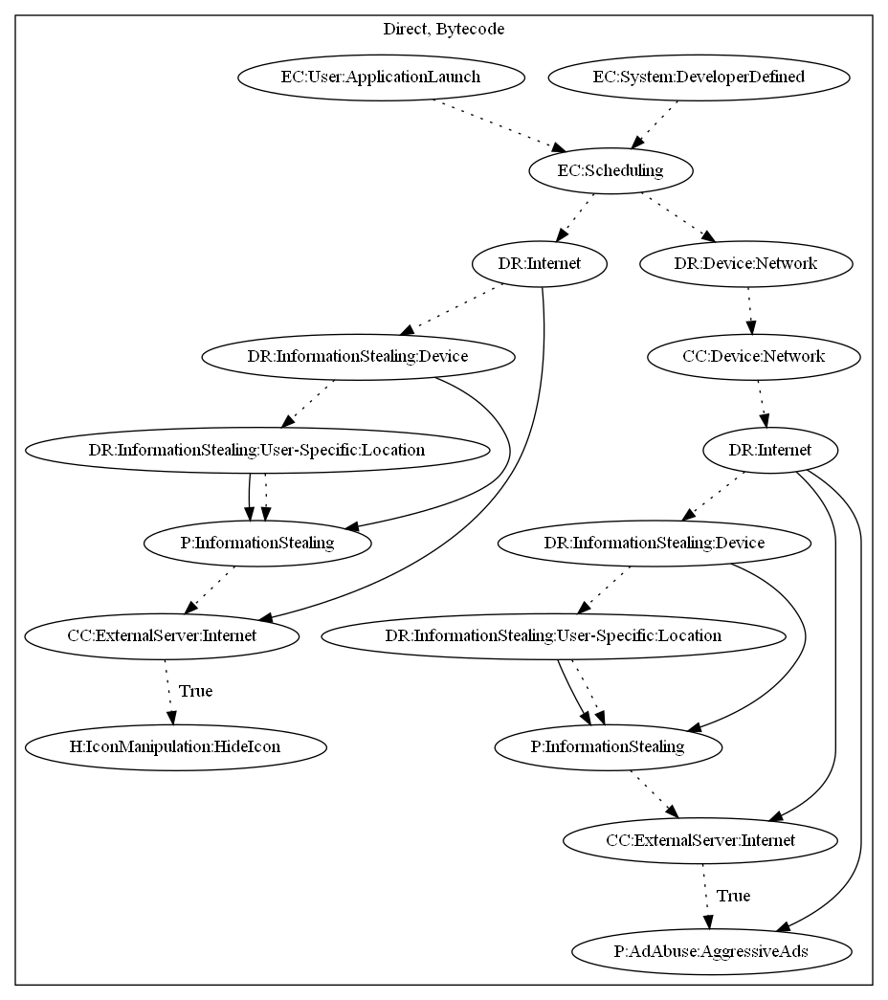

# HiddenAdOS

## High-level Description

* Year: 2020
* File Hash (SHA-256): 1b8d5b68803f4e27bb0ffdbbc383b2d9b1630cd20a289ea9ce8400649a808261
* Blog: https://www.kaspersky.com/blog/minecraft-mod-adware-google-play/37717/

This malware sample aims to perform aggressive advertisement. The malware schedules two threads that run upon launching the application or receiving Firebase messages. It then registers the device with the malware developers server (leaking device and location information), then has the ability to (1) hide the app icon, and (2) push full screen ads to the user.

## Signature
---

The image of the signature can be downloaded [here](../../img/signatures/HiddenAdOS.png) for closer inspection.

