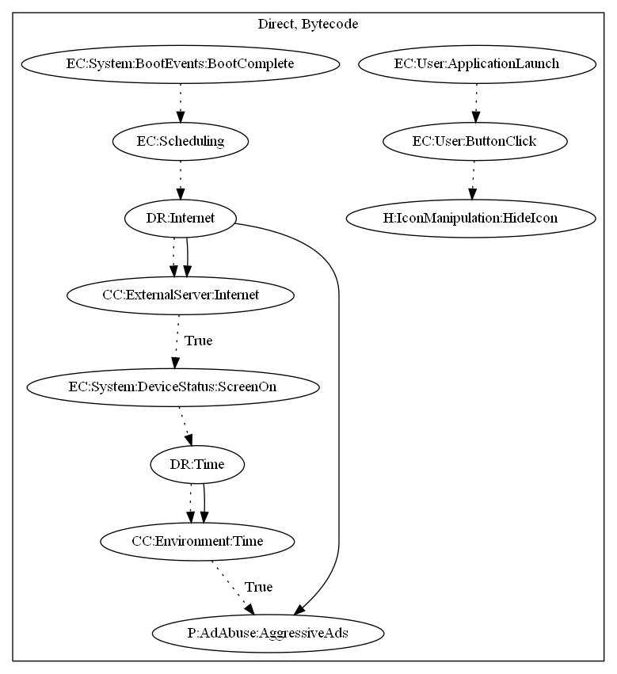

# HidenAd

## High-level Description

* Year: 2019
* File Hash (SHA-256): 8d06c9159ce70dda0718b00b2f170fbca2c16bde088343d14da746d657351ef1
* Blog: https://blog.trendmicro.com/trendlabs-security-intelligence/adware-disguised-as-game-tv-remote-control-apps-infect-9-million-google-play-users/

This malware application aims to push full screen ads to the user. The sample retrieves commands and ad configuration from the malware developers server. It then pushes full screen ads to the user when the screen is on and a certain time period (since the last ad was shown) has past. This sample also contains the capability of hiding its icon after the user interacts with the sample by pressing a button on the screen after application launch.

## Signature
---

The image of the signature can be downloaded [here](../../img/signatures/HidenAd.png) for closer inspection.

