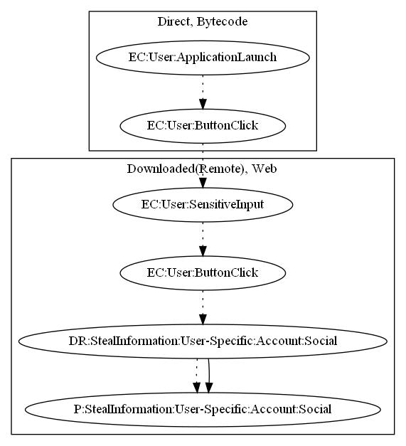

# InstaDetector

## High-level Description

* Year: 2016
* File Hash (SHA-256): 7ee3fc140310d70806c74307670e1472774f583bcbf14365fb827afda6458d2c
* Blog: https://www.pandasecurity.com/mediacenter/social-media/we-know-whos-viewed-your-instagram-and-its-not-who-you-think/, https://securelist.com/who-viewed-you-instagram-account-and-who-stole-your-password/74260/

This malware application aims to steal instagram credentials. The user presses a begin button upon launch and a WebView is opened as a result with a fake instagram login page. Credentials are stolen once the user inputs the sensitive data and presses the login button.

## Signature
---

The image of the signature can be downloaded [here](../../img/signatures/InstaDetector.png) for closer inspection.

