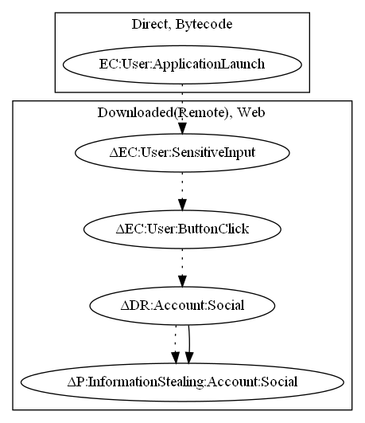

# InstaZuna

## High-level Description

* Year: 2017
* File Hash (SHA-256): 5839066d09e52d1e406648058dabf1ee979e3139bfc44713c82410bd28c705ad
* Blog: https://securingtomorrow.mcafee.com/other-blogs/mcafee-labs/turkish-instagram-password-stealers-found-google-play/

This malware application aims to steal instagram credentials from the user. Upon launch of the application, the app launches a remote website. Once the user selects the login button on the website and inputs their credentials, the app leaks their instagram credentials to the malware developer.

## Signature
---

The image of the signature can be downloaded [here](../../img/signatures/InstaZuna.png) for closer inspection.

