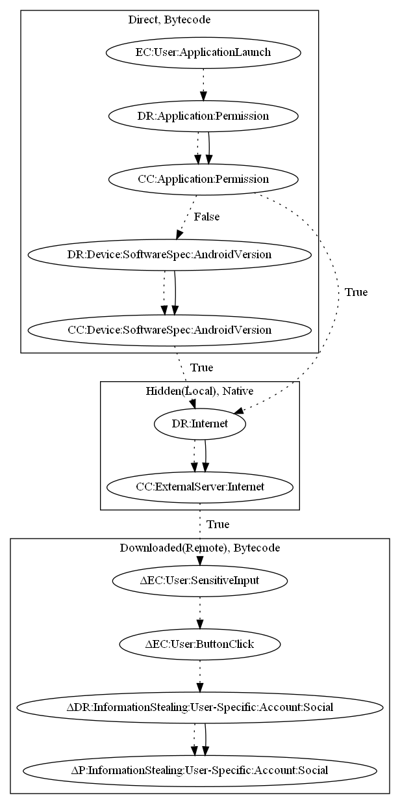

# Malbus

## High-level Description

* Year: 2019
* File Hash (SHA-256): e71dc11e8609f6fd84b7af78486b05a6f7a2c75ed49a46026e463e9f86877801
* Blog: https://securingtomorrow.mcafee.com/other-blogs/mcafee-labs/malbus-popular-south-korean-bus-app-series-in-google-play-found-dropping-malware-after-5-years-of-development/

This malware application aims to steal social accounts form the user. The sample retrieves commands and an executable from the malware developers server. The payload executes phishing forms (an observed behavior) to steal social accounts from the user.

## Signature
---

The image of the signature can be downloaded [here](../../img/signatures/Malbus.png) for closer inspection.

