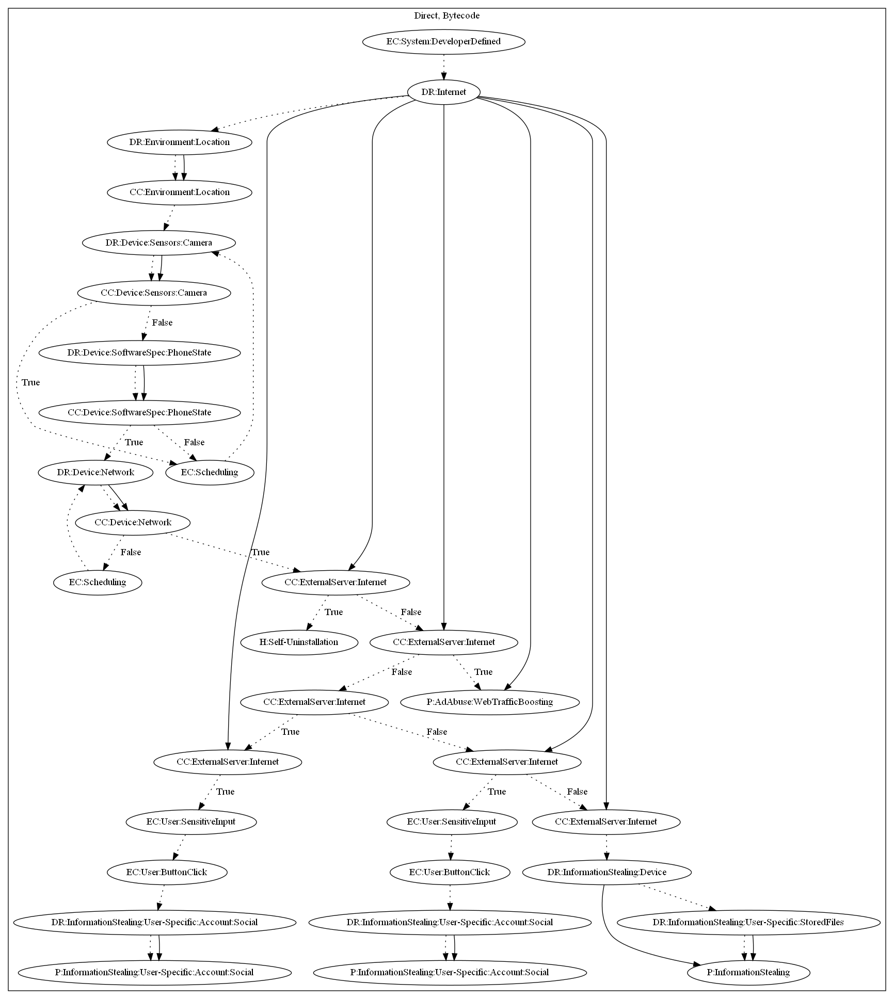

# MobstSpy

## High-level Description

* Year: 2019
* File Hash (SHA-256): a645a3f886708e00d48aca7ca6747778c98f81765324322f858fc26271026945
* Blog: https://blog.trendmicro.com/trendlabs-security-intelligence/spyware-disguises-as-android-applications-on-google-play/

This malware sample attempts to perform a variety of payloads. The malware activates upon receiving Firebase messages. It then checks whether the user is within a certain location, the camera is off, and the phone is not within a call. It then checks whether the command is one of the following: (1) Self-Uninstall, (2) Web Traffic Boosting, (3) Phish for Facebook credentials, (4) Phish for WhatsApp credentials, (5) Steal stored files on the device.

## Signature
---

The image of the signature can be downloaded [here](../../img/signatures/MobstSpy.png) for closer inspection.

