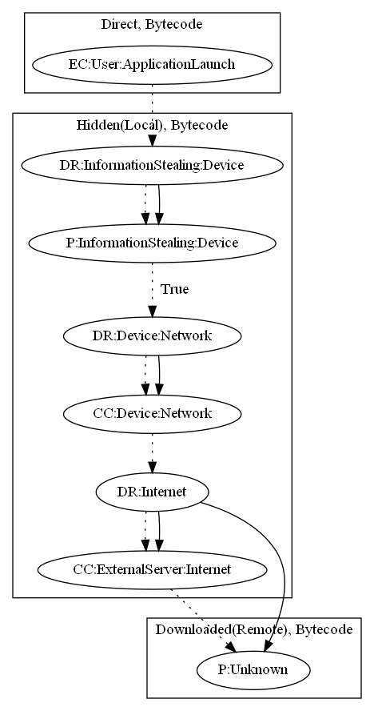

# Necron

## High-level Description

* Year: 2019
* File Hash (SHA-256): c7a04cb8a1fd890708b8f224024245a0b5871986b4f7b6c196258ed5948770a5
* Blog: https://www.kaspersky.com/blog/camscanner-malicious-android-app/28156/

This malware decrypts a payload in local assets which contacts the malware developers server. It then downloads additional unknown payloads (the blog describes it to be anything).

## Signature
---

The image of the signature can be downloaded [here](../../img/signatures/Necron.png) for closer inspection.

