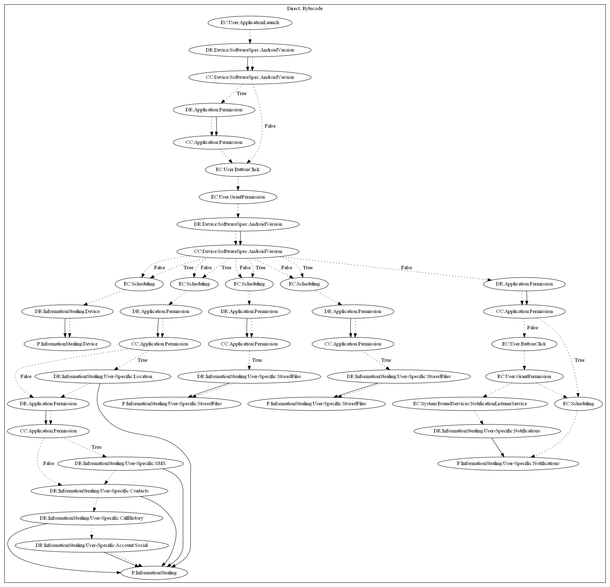

# ProjectSpyHRX

## High-level Description

* Year: 2020
* File Hash (SHA-256): 29b0d86ae68d83f9578c3f36041df943195bc55a7f3f1d45a9c23f145d75af9d
* Blog: https://blog.trendmicro.com/trendlabs-security-intelligence/coronavirus-update-app-leads-to-project-spy-android-and-ios-spyware/

This malware aims to steal user information. It first checks the Android version and requests notification listener service permissions. It then runs four/five different threads depending on the Android version to (1) steal device information, (2) steal SMS/contacts/call history, (3) steal stored files within the WhatsApp folder, (4) steal voice notes from the WhatsApp folder, and (5) steal notification messages.

## Signature
---

The image of the signature can be downloaded [here](../../img/signatures/ProjectSpyHRX.png) for closer inspection.

