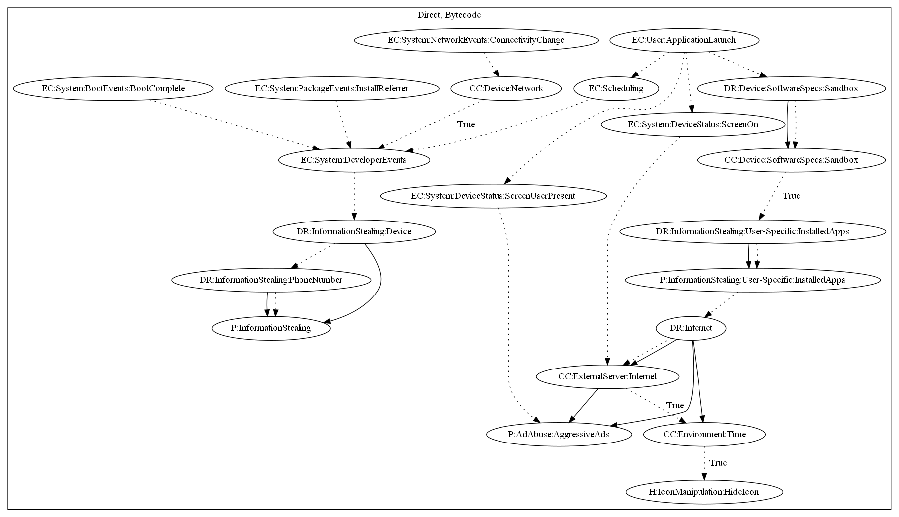

# Reputation2

## High-level Description

* Year: 2018
* File Hash (SHA-256): 17d42f63336dcf404b9b80ee7860c70fdd43417a564cede47824094d0a84875d
* Blog: https://blog.trendmicro.com/trendlabs-security-intelligence/apps-disguised-security-tools-bombard-users-ads-track-users-location/

This malware sample contains the ability to push full screen ads to the user. It also contains the ability to steal device or user information. The malware sample collects device and user-specific information on boot events (Boot Complete), package events (Install Referrer), network events (Connectivity Change), and by scheduling a repeating alarm. It also registers a broadcast receiver that pushes full screen ads when the device unlocks or screen turns on. Lastly, it hides it's icon on application launch after checking for sandbox environments and a set period of time passes.

## Signature
---

The image of the signature can be downloaded [here](../../img/signatures/Reputation2.png) for closer inspection.

