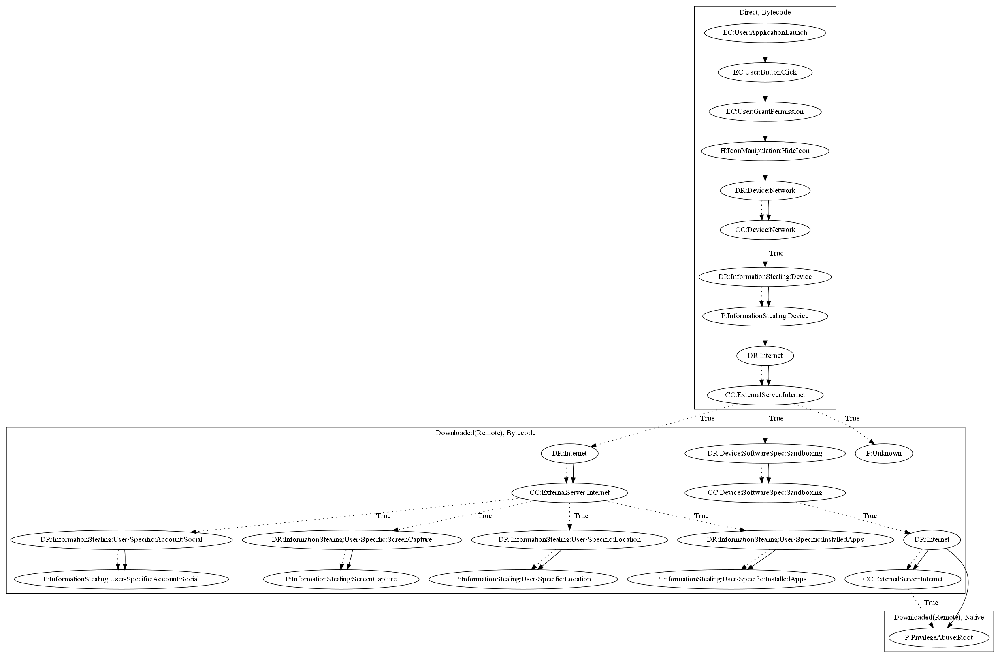

# SideWinder

## High-level Description

* Year: 2020
* File Hash (SHA-256): 0daefb3d05e4455b590da122255121079e83d48763509b0688e0079ab5d48886
* Blog: https://www.trendmicro.com/en_us/research/20/a/first-active-attack-exploiting-cve-2019-2215-found-on-google-play-linked-to-sidewinder-apt-group.html

This malware aims to perform privilege abuse and steal information or download additional unknown payloads. Upon launching the app, it attempts to hide the app icon. It then contacts the malware developers server to retrieve an additional bytecode payload. It further contacts the server to collect native exploits used to root the device. It then can download additional apps to perform an unknown payload, or leak social accounts, the screen, location, or installed apps of the device.

## Signature
---

The image of the signature can be downloaded [here](../../img/signatures/SideWinder.png) for closer inspection.

