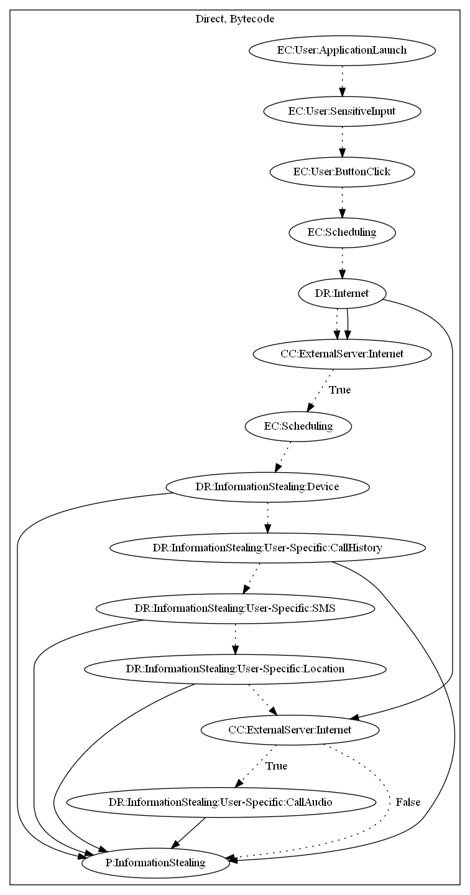

# Smesh

## High-level Description

* Year: 2016
* File Hash (SHA-256): 60e0bf964c6ff03bcd2efa0aa6b2d463633d7bbbf5bcc30eb48297e5d2d9b16f
* Blog: https://blog.trendmicro.com/trendlabs-security-intelligence/operation-c-major-actors-also-used-android-blackberry-mobile-spyware-targets/

This malware acts as a chatting application. The "admin" user of the app sends messages to the user which activate data leakage of the users call history, sms, location, and call audio. 

## Signature
---

The image of the signature can be downloaded [here](../../img/signatures/Smesh.png) for closer inspection.

