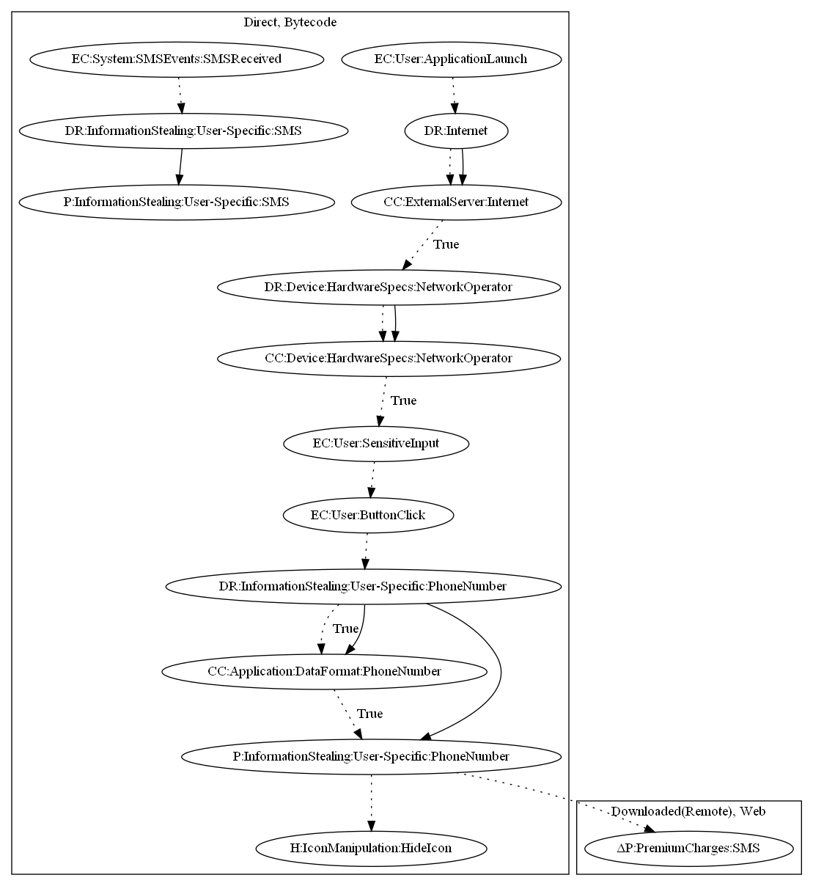

# SMSAndroidOSWesp

## High-level Description

* Year: 2017
* File Hash (SHA-256): f14e56accc05f44566f1c2936bf56cf6e1e1d01624bd91563e22cff30dbc195f 
* Blog: https://securelist.com/expensive-free-apps/77083/

This malware sample aims to perform premium charges via SMS. The malware contacts it's C&C server initially to ensure the server is up. It then checks to make sure the network operator matches a certain string (ex., "RANG"). 
The user then inputs a phone number and malware verifies the input. The phone number is sent to the malware developers server to subscribe the number to an online service (yourmob.com). This sample also contains capabilities to intercept SMS messages to retrieve confirmation codes from the online service.

## Signature
---

The image of the signature can be downloaded [here](../../img/signatures/SMSAndroidOSWesp.png) for closer inspection.

