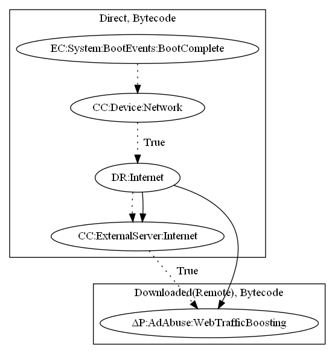

# SockBot

## High-level Description

* Year: 2017
* File Hash (SHA-256): 5793be5a524dce808bac8259fd484146aad71f691e0760185f009b8b54d5691e 
* Blog: https://www.symantec.com/connect/blogs/android-malware-google-play-adds-devices-botnet-and-performs-ddos-attacks

This malware sample aims to perform web traffic boosting. It retrieves ad configuration from the malware developers server on device boot when network is available. The malware sample then aims to connect to an ad server to perform ad requests.

## Signature
---

The image of the signature can be downloaded [here](../../img/signatures/SockBot.png) for closer inspection.

