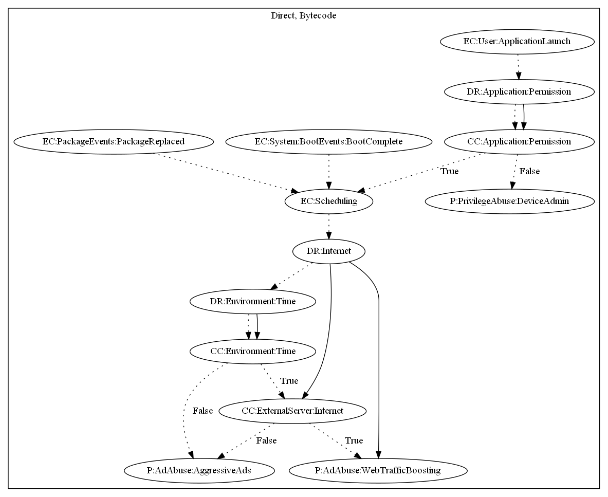

# Solid

## High-level Description

* Year: 2017
* File Hash (SHA-256): e346e61debfcc86bebe5796f225804766754c8b66c25d4e5f432fa4b19b8e51c
* Blog: https://blog.malwarebytes.com/cybercrime/2017/10/mobile-menace-monday-despicable-adware/

This malware sample aims to perform ad abuse. The malware sample schedules a task to retrieve commands from it's C&C server. It has the ability to open a website link retrieved from the C&C server after a certain time has passed. Otherwise, it aggressively pushes full screen ads to the user. The malware sample also performs privilege abuse by requesting device admin permissions on application launch.

## Signature
---

The image of the signature can be downloaded [here](../../img/signatures/Solid.png) for closer inspection.

