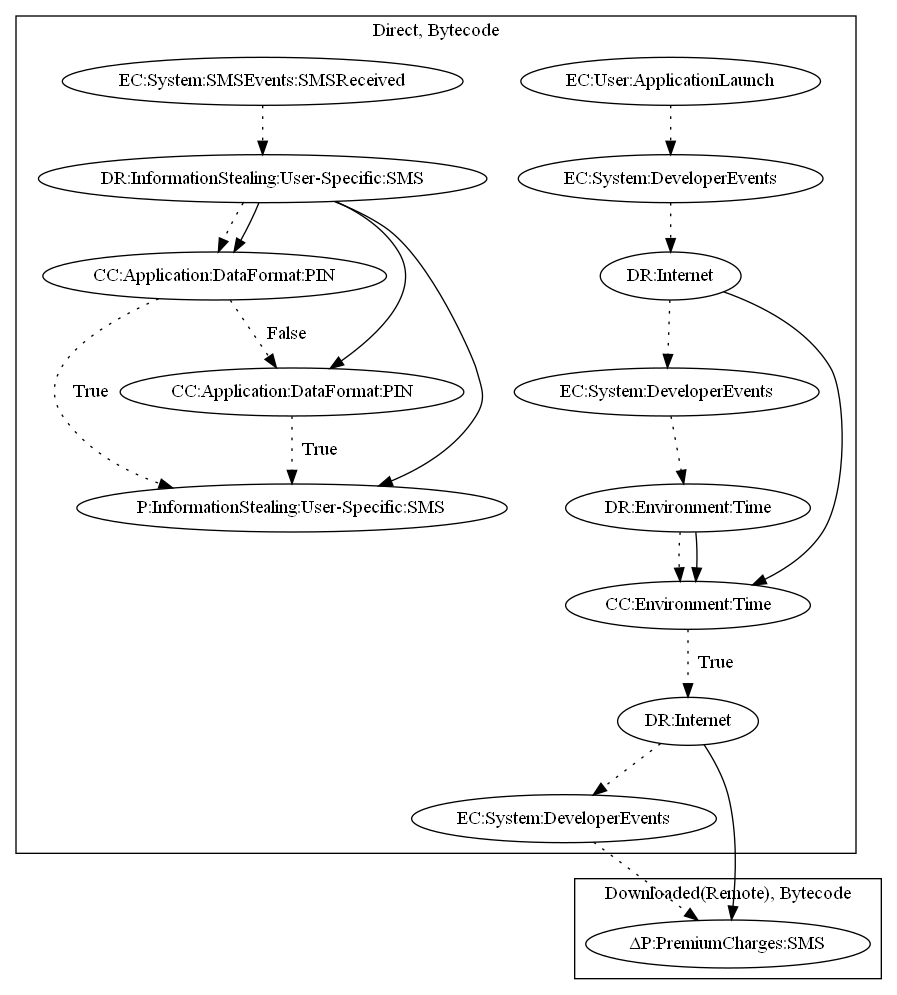

# Sonyvpay

## High-level Description

* Year: 2018
* File Hash (SHA-256): 818188858c005fbe91fb5317f06efd6deb165f62cb2159c04b6b87b3473f657f
* Blog: https://securingtomorrow.mcafee.com/consumer/consumer-threat-notices/android-users-mobile-billing-fraud-due-to-sonvpay-malware/

This malware sample aims to perform premium charges via SMS. The malware waits a period of time based on configuration that is sent via push notifications. It then downloads an executable that performs premium SMS charges (an observed behavior). The malware sample also contains capabilities to intercept SMS messages that contain a pin. This malware sample uses two data format checks to identify pin messages from two different premium charge services. 

## Signature
---

The image of the signature can be downloaded [here](../../img/signatures/Sonyvpay.png) for closer inspection.

