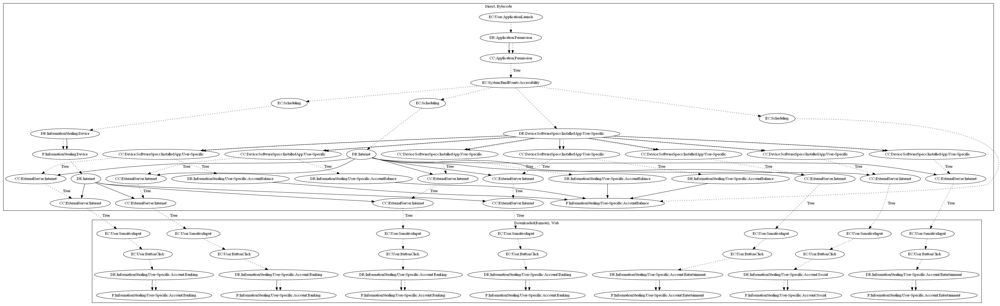

# SpyBankerAJZ

## High-level Description

* Year: 2018
* File Hash (SHA-256): 6265678c9de6987389ee9936a893fc98c90e8e468cc7f0b7c8b1128aa7cb4e88
* Blog: https://www.welivesecurity.com/2018/12/11/android-trojan-steals-money-paypal-accounts-2fa/

This malware sample aims to steal various account credentials and banking information from the user. The malware sample creates multiple tasks after the user grants accessibility permissions. Two tasks retrieve commands from the malware developers server to collect: (1) phishing website links, and (2) commands to enable phishing. It then can phish for credentials and account balance for four brazilian banks. In addition to the four banks, it also aims to steal account credentials to popular entertainment and social websites.

## Signature
---

The image of the signature can be downloaded [here](../../img/signatures/SpyBankerAJZ.png) for closer inspection.

