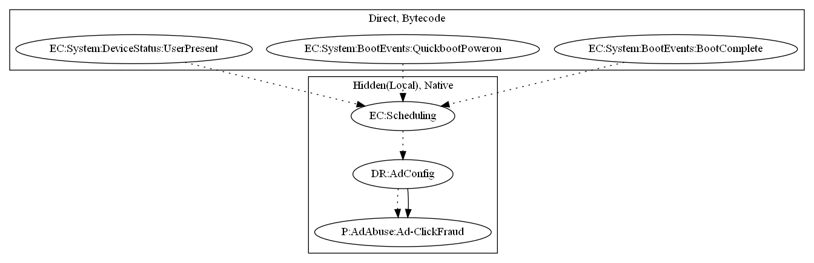

# Tekya

## High-level Description

* Year: 2020
* File Hash (SHA-256): f1d32c17a169574369088a87f2df9e56df2abeeeda0b7f4c826da5f4f69d11e4
* Blog: https://research.checkpoint.com/2020/google-play-store-played-again-tekya-clicker-hides-in-24-childrens-games-and-32-utility-apps/

This malware attempts to perform ad click fraud. It loads a native payload which schedules an alarm to display ads and perform motion event clicks on the advertisement.

## Signature
---

The image of the signature can be downloaded [here](../../img/signatures/Tekya.png) for closer inspection.

