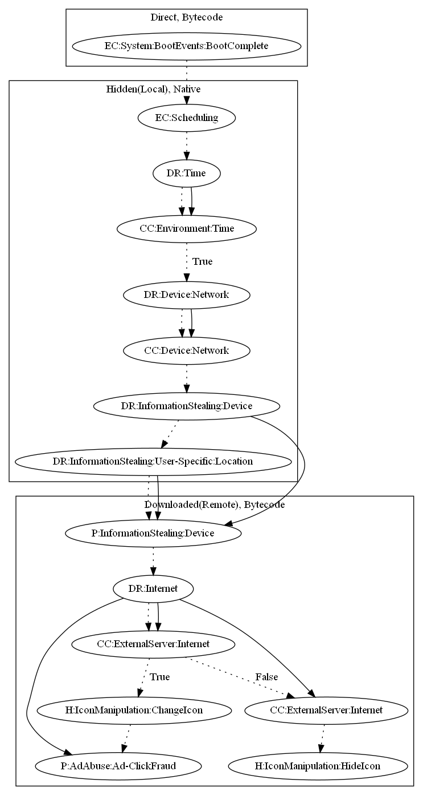

# TekyaHRX

## High-level Description

* Year: 2020
* File Hash (SHA-256): 359f581980faa4e27acf19a9bfae0214d6e92690bcbce0d19e9b0053200f6cd2
* Blog: https://www.trendmicro.com/en_us/research/20/f/new-tekya-ad-fraud-found-on-google-play.html

This malware attempts to perform ad click fraud. It loads a native payload that waits a set amount of time and contacts the malware developers server -- leaking both device and user-specific information. It then downloads an additional bytecode payload based on response from the server and provides commands that (1) collect ad configuration, change the icon of the app to another installed app on the device, and perform ad click fraud, or (2) hide the app icon.

## Signature
---

The image of the signature can be downloaded [here](../../img/signatures/TekyaHRX.png) for closer inspection.

