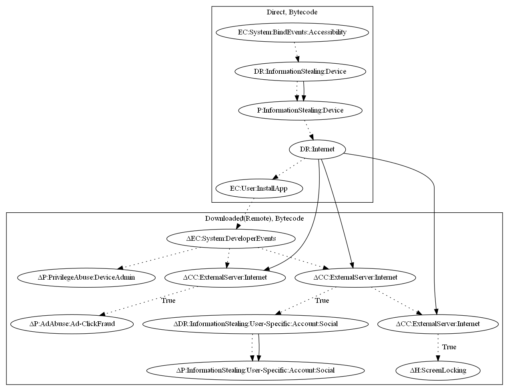

# ToastAmigo

## High-level Description

* Year: 2017
* File Hash (SHA-256): 17db44bc45b66b682320abb8d5805690765b138a23519e89fdf9ad91bf5383ff
* Blog: https://blog.trendmicro.com/trendlabs-security-intelligence/toast-overlay-weaponized-install-android-malware-single-attack-chain/

This malware sample aims to perform ad-click fraud and steal user information. Once gaining accessibility permissions, it sends device information to the malware developers server. The malware sample then retrieves an additional application and a set of commands. The additional application requests device admin privileges and listens on previously sent commands to perform: (1) ad-click fraud, (2) steal google account credentials, and (3)perform screen locking.

## Signature
---

The image of the signature can be downloaded [here](../../img/signatures/ToastAmigo.png) for closer inspection.

