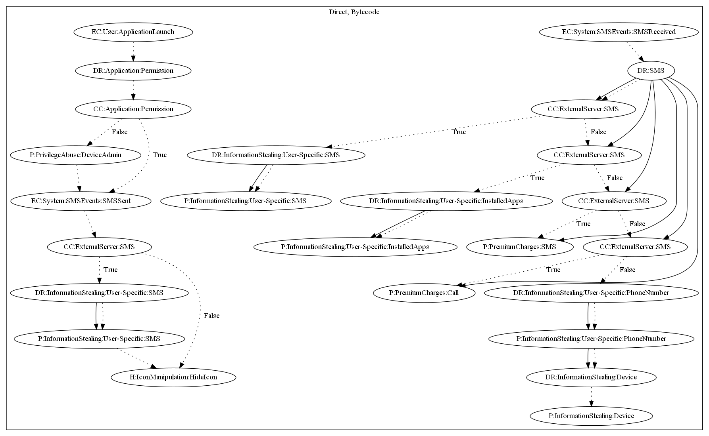

# AceCard

## High-level Description

* Year: 2016
* File Hash (SHA-256): 3c0a9db3f1df04e23c5b8bd711402570a370474853df2541ef187b9997721bc3
* Blog: https://securelist.com/the-evolution-of-acecard/73777/

This malware sample receives SMS commands from the malware developers server to enable the interception of messages, collect SMS messages, create calls to premium numbers, and leak user-specific information (i.e., Device information, Phone Number, Installed Apps). It also contains the ability to perform privilege abuse by requesting device admin permissions and hiding the icon on launching the application.

## Signature
---

The image of the signature can be downloaded [here](../../img/signatures/AceCard.png) for closer inspection.

