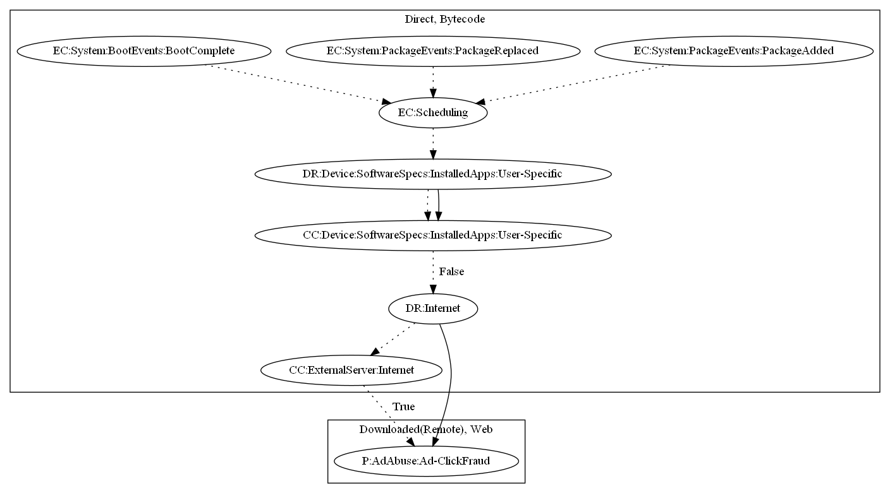

# AdloadNL

## High-level Description

* Year: 2017
* File Hash (SHA-256): 79c574c4a628b8be8f29fd41f76007e303bbf02d609d1e3a62ca6c2ae7083e1d
* Blog: https://nakedsecurity.sophos.com/2017/06/05/punching-down-the-judy-android-malware-a-sophoslabs-analysis/

This malware sample aims to perform ad-click fraud on the users device. On boot complete, package replaced, and package added, the malware schedules an alarm to periodically run. If an installed app is not found on the device, the malware collects commands from the malware developer's C&C server to perform ad-click fraud.

## Signature
---

The image of the signature can be downloaded [here](../../img/signatures/AdloadNL.png) for closer inspection.

