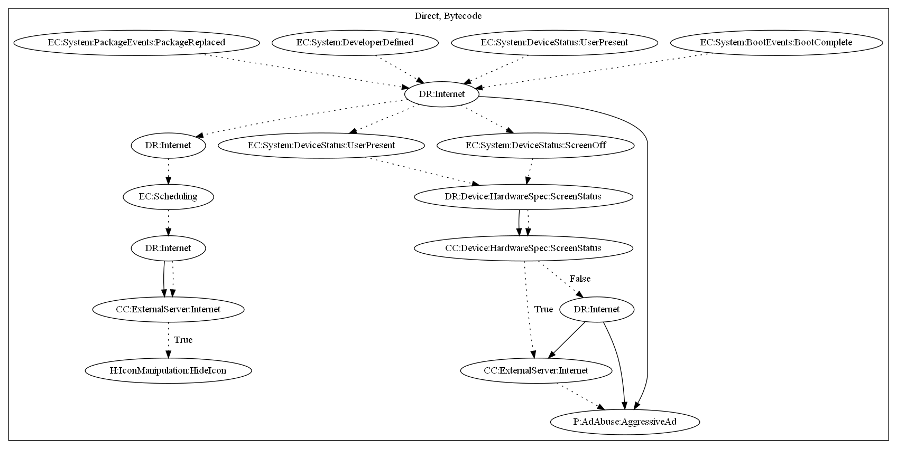

# AdultSwine

## High-level Description

* Year: 2018
* File Hash (SHA-256): 08a595d274c5988a975a2746705422cbf110ce1de6e0b66fd798acc961a30687
* Blog: https://research.checkpoint.com/2018/malware-displaying-porn-ads-discovered-in-game-apps-on-google-play/

This malware sample aims to push full screen ads to the user. It listens on a variety of system events (package replaced, developer defined, user present, boot complete), and collects configuration from the malware developers server. It then dynamically registers a receiver on user present and screen off events. It collects illegitimate ads using screen off events, and displays the ads when the user is present (and screen is on). It further schedules an alarm to hide the app icon upon response from the malware developers server.

## Signature
---

The image of the signature can be downloaded [here](../../img/signatures/AdultSwine.png) for closer inspection.

