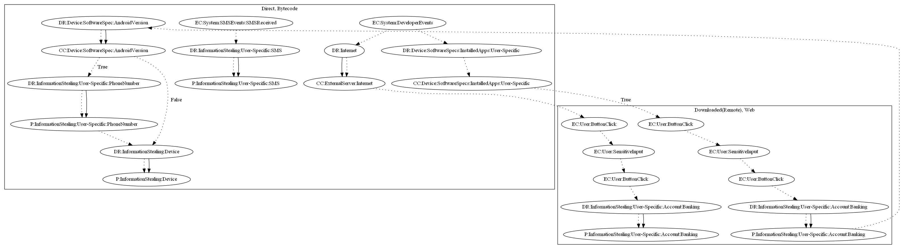

# AgentBKY

## High-level Description

* Year: 2017
* File Hash (SHA-256): 86aaed9017e3af5d1d9c8460f2d8164f14e14db01b1a278b4b93859d3cf982f5
* Blog: https://www.welivesecurity.com/2017/12/11/banking-malware-targets-polish-banks/

This malware sample aims to steal device/user-specific information from the user. The malware contains the capability to listen on SMS Received events to intercept SMS messages. The malware retrieves commands from Firebase push notification services to push scam notifications that open bank phishing web pages. In addition, phishing pages are forcefully pushed to the user if a banking app is on the device. In the second case, the users phone number and device information are also stolen from the user.

## Signature
---

The image of the signature can be downloaded [here](../../img/signatures/AgentBKY.png) for closer inspection.

