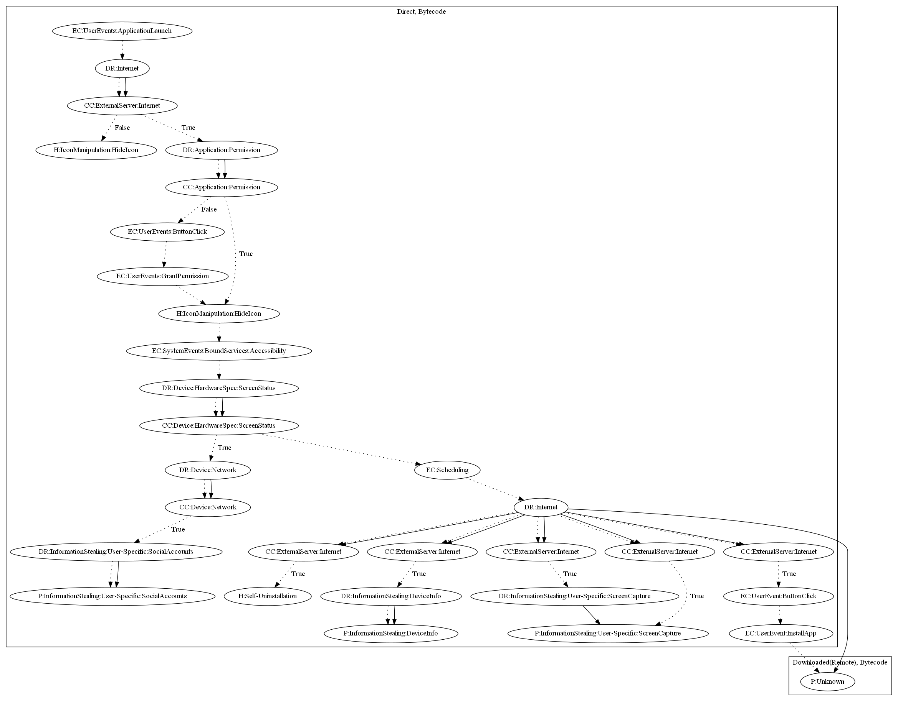

# AndroidOSBrata

## High-level Description

* Year: 2019
* File Hash (SHA-256): 5395936963df4d72b365fd30ab52a00a88f8a5f75336ba84ac8a9fc369e0f811
* Blog: https://securelist.com/spying-android-rat-from-brazil-brata/92775/

This malware sample aims to perform a series of payloads depending on commands from the malware developers server. It first requests accessibility permissions, and leaks information when the screen is on and network is available. It further hides the app icon. It then can (1) leak device information, (2) steal social accounts from the device, (3) capture the screen, (4) or launch google play to to install other applications, (5) self-uninstall.

## Signature
---

The image of the signature can be downloaded [here](../../img/signatures/AndroidOSBrata.png) for closer inspection.

