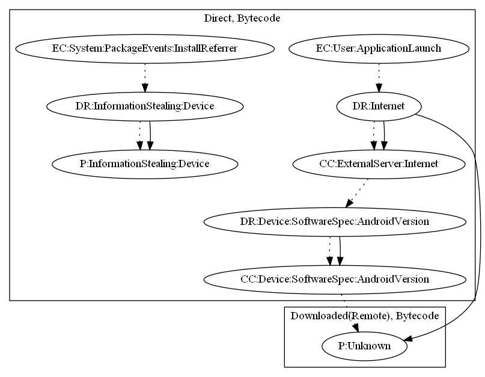

# AndroidOSXavierAXM

## High-level Description

* Year: 2017
* File Hash (SHA-256): aea401d9b4c1ec385992b465c02e7c33d9eebc14e28f14ac14214bfd2f93c7bd
* Blog: https://blog.trendmicro.com/trendlabs-security-intelligence/analyzing-xavier-information-stealing-ad-library-android/, https://blog.trendmicro.com/trendlabs-security-intelligence/analyzing-xavier-information-stealing-ad-library-android/

This malware sample aims to steal information and perform an unknown payload. The retrieves commands from the malware developer's C&C server to download and execute the unknown payload on launch of the application. The device information is leaked to the malware developer's server when the user installs an app through advertisement referrers.

## Signature
---

The image of the signature can be downloaded [here](../../img/signatures/AndroidOSXavierAXM.png) for closer inspection.

