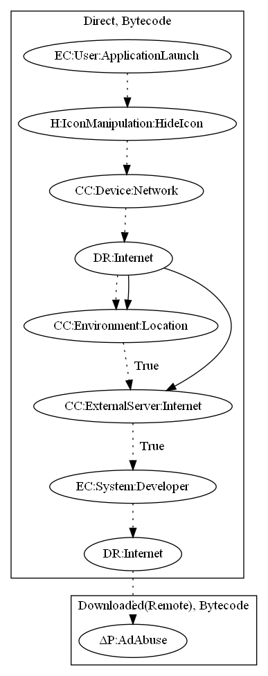

# AsiaHitGroup

## High-level Description

* Year: 2017
* File Hash (SHA-256): e45cd99a664c5bb68ea7ab8e8f47f329bd01dc1193106e25962478b5259c0009
* Blog: https://blog.malwarebytes.com/cybercrime/2017/11/new-trojan-malware-discovered-google-play/

This malware sample aims to download an additional application to perform an ad abuse payload. The malware hides its icon, checks network connectivity, and collects location information to target specific regions of the world on launch of the application. It then retrieves commands to download an APK from an online server. Lastly, the malware sample virtually installs the downloaded APK and runs it on the user's device to perform an ad abuse payload.

## Signature
---

The image of the signature can be downloaded [here](../../img/signatures/AsiaHitGroup.png) for closer inspection.

