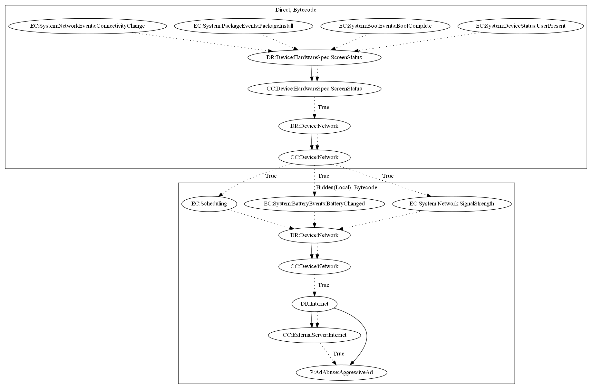

# AxentEH

## High-level Description

* Year: 2017
* File Hash (SHA-256): 7876fe4c7c93eacac7d176ced5a6fad30388423fd30d1a37e0abae1f9a86bde9
* Blog: https://nakedsecurity.sophos.com/2017/05/30/why-you-should-avoid-star-hop-and-candy-link-in-google-play/

This malware sample aims to display full screen ads to the user. It listens on a variety of system-wide events (user present, boot complete, package install, connectivity change), then checks that the network and screen is on. It then decrypts and loads a local payload which contacts the malware developers server to retrieve ad configuration and push full screen ads.

## Signature
---

The image of the signature can be downloaded [here](../../img/signatures/AxentEH.png) for closer inspection.

