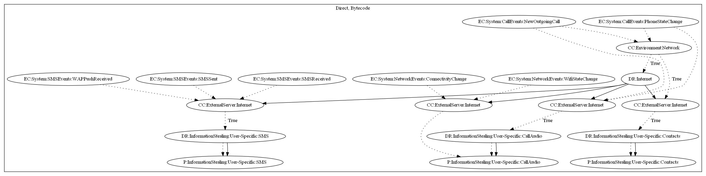

# Bahamut

## High-level Description

* Year: 2018
* File Hash (SHA-256): 0d349d085c81fde9febc3b67d615ff35b6823d1742f6039aff4f2b8a68f06bfb
* Blog: https://blog.trendmicro.com/trendlabs-security-intelligence/the-urpage-connection-to-bahamut-confucius-and-patchwork/

This malware sample aims to steal call audio, contacts, and SMS messages from the user. The malware retrieves commands based on when the user retrieves a phone call (New Outgoing Call) or handles a phone call (Phone State Change). SMS messages are sent to the malware developers server on SMS related events (SMS Received/Sent, WAP Push Billing). The malware sample records call audio and steals contact information on call related events (Phone State Change and New Outgoing Call). Lastly, the audio files are sent to the malware developers server on network related events (Connectivity Change and Wifi State Change). 

## Signature
---

The image of the signature can be downloaded [here](../../img/signatures/Bahamut.png) for closer inspection.

